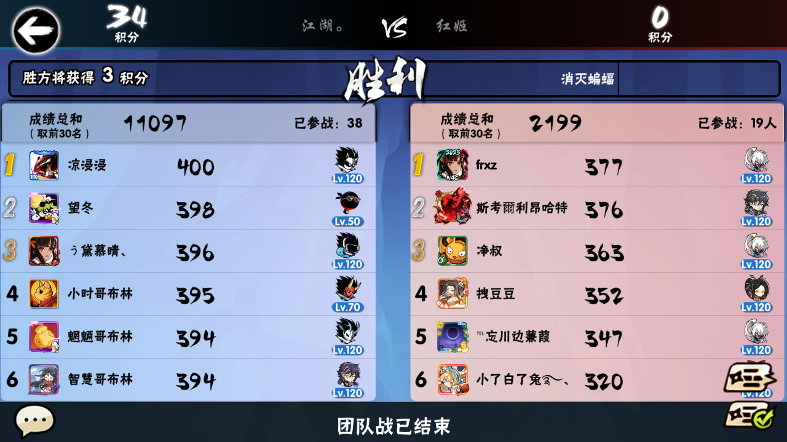
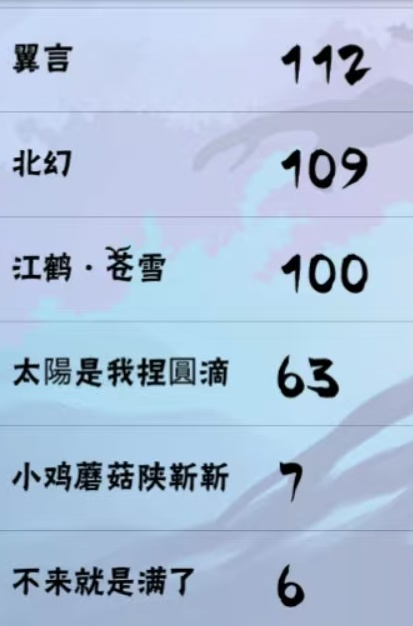

# 基于深度学习OCR的积分识别系统-忍三家族战

本项目基于深度学习OCR模型，对忍三家族战的积分截图进行识别，输出姓名-积分的对应结果

## 功能特点

- **极高准确率**：通过对输入图像进行预处理，结合Paddle OCR深度学习算法，识别结果能达到100%准确率
- **简单易用**：利用Anaconda配置python环境，简单易用
- **集成度高**：项目封装良好，用户可以专注于处理输入输出
- **易于理解**：代码注释丰富，便于后续开发者理解和修改

## 安装步骤

#### 1. 安装anaconda，然后在命令行中创建虚拟环境：
```
conda create -n ninja3
```
#### 2. 启动虚拟环境：
```
activate ninja3
```
#### 3. 安装必备的python库：
```
pip install -r requirements.txt
```

## 使用方法

#### 1. 利用第三方截图软件，获得格式一致的家族战积分截图，如: 

{:height="50%" width="50%"}

#### 2. 编辑config.yml

- process_path对应预处理的输入、输出路径
- orc_path对应图像识别的输入、输出路径

#### 3. 运行python image_process.py，对原始截图进行裁剪
利用鼠标框选截图区域后，按回车确认即可（倘如截取区域选取不满意，可以重复框选，上一次的结果会被自动擦除）

{:height="25%" width="25%"}


#### 4. 运行python main.py，对截图进行OCR识别

## 贡献者
| 姓名 | 贡献 | 联系方式 |
| - | - | - |
| 7.18 | 项目创建，优化数据处理逻辑 | - |
| LEFT | 深度学习识别算法，图像预处理 | 2724682324@qq.com |

## 许可证信息

本项目采用 MIT 许可证，详情请参考 [LICENSE 文件](./LICENSE)
